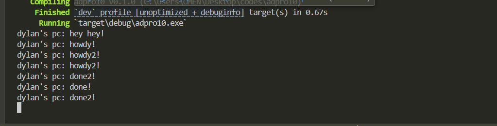
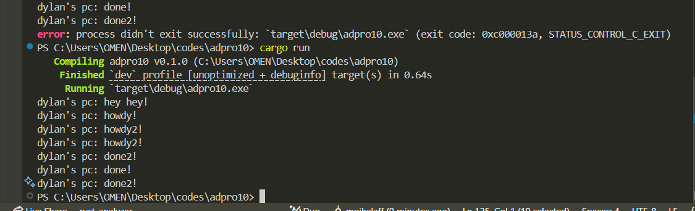

### 1.2
First message ("hey hey!"), Second message ("howdy!"), hird message ("done!"). The "hey hey!" message appears first even though it was called after the spawner, this is because the compiler executes this code the immediately after spawning the async spawner.

### 1.3
without drop spawner

with drop spawner

without the drop spawner, the compiler doesnt stop automatically, it has to be manually stopped by ctrl+c. the output is relatively the same. below are answers to the questions:
1. What is the effect of spawning?
        Spawning adds asynchronous tasks to a queue without executing them immediately. When a task is spawned, it gets packaged into a Task structure and sent through a channel to await execution by the executor. This allows multiple operations to be prepared concurrently while their actual execution is managed separately by the runtime system, creating an efficient way to organize asynchronous work.
2. What is the spawner, executor, and drop for?
        The spawner, executor, and drop work together in a coordinated system to manage asynchronous execution. The spawner creates and queues tasks by packaging futures into executable units and sending them through a channel, while the executor receives these tasks and handles their execution lifecycle, including polling futures and managing their continuation after await points. The drop operation serves as a critical signal that no more tasks will be sent, allowing the executor to recognize when all work is complete rather than waiting indefinitely for new tasks. Without dropping the spawner, the executor would continue running in a pending state, expecting additional work that never arrives, which is why manual termination becomes necessary.
3. What is the correlation of all of that?
        these components form a complete asynchronous runtime system where the spawner acts as the entry point for task creation, the channel provides communication between task creation and execution contexts, and the executor manages the actual running of tasks. Each has a distinct responsibility in the lifecycle of asynchronous tasks: the spawner initiates, the executor processes, and the drop terminates. This separation of concerns allows for efficient interleaving of execution when tasks are waiting on external resources (like timers or I/O), enabling concurrent-looking code to run efficiently without blocking threads. The relationship becomes evident when comparing execution with and without dropping the spawner - while tasks execute identically in both scenarios, only with proper dropping does the program terminate naturally after completing all work.
